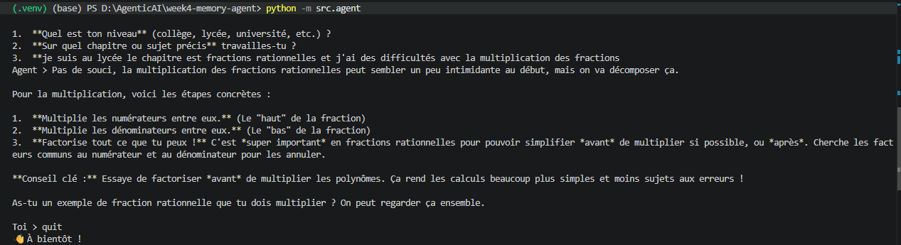
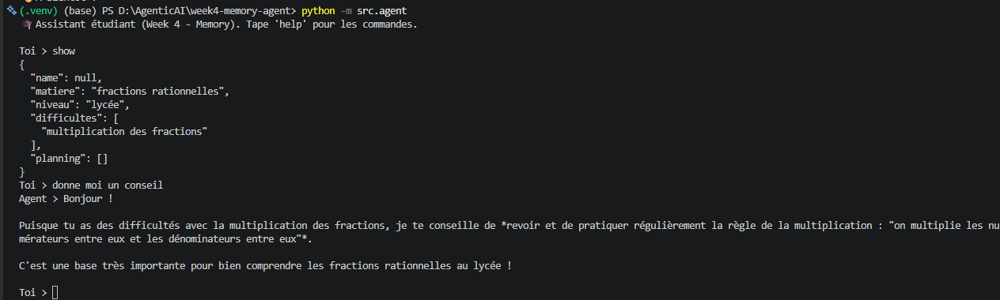
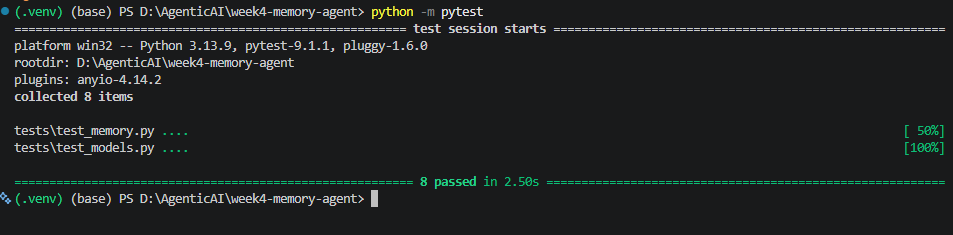

# Week 4 — Memory Agent 🧠

Assistant étudiant personnel avec **mémoire persistante**, construit avec Gemini (`google-genai`) et Pydantic.

Ce projet fait suite à :
- Week 1 → LLM + Structured Output
- Week 2 → Tool Calling
- Week 3 → RAG

**Week 4** : transformer un simple chatbot en véritable **agent** capable de se souvenir de l'étudiant d'une session à l'autre.

---

## 🎯 Objectif

Un LLM n'a, par nature, **aucune mémoire** : chaque appel API est indépendant. Ce projet ajoute deux couches de mémoire pour construire un vrai agent :

| Type | Rôle | Durée de vie |
|---|---|---|
| **Short-Term Memory (STM)** | Historique de la conversation en cours | Perdue à la fermeture du programme (en RAM) |
| **Long-Term Memory (LTM)** | Profil de l'étudiant (matière, niveau, difficultés, planning) | Persistée dans `data/memory.json`, relue à chaque lancement |

L'agent peut ainsi répondre :

> *"Tu m'avais indiqué préparer un concours en Science. Comme tu as des difficultés sur les questions ouvertes, je te conseille..."*

Ce n'est plus un chatbot. C'est un agent.

---

## 🏗️ Architecture du projet

```
week4-memory-agent/
│
├── .venv/
├── .env
├── .gitignore
├── requirements.txt
├── README.md
├── pytest.ini
│
├── data/
│   └── memory.json          # mémoire long-terme persistée (ignorée par git)
│
├── src/
│   ├── __init__.py
│   ├── config.py             # variables d'environnement + client Gemini
│   ├── models.py              # modèles Pydantic (StudentMemory, ConversationTurn, MemoryUpdate)
│   ├── utils.py                # lecture/écriture JSON génériques
│   ├── memory.py                # read/save/update/reset de la mémoire
│   ├── prompts.py                # construction des prompts (context injection)
│   └── agent.py                   # boucle de conversation + appels Gemini
│
└── tests/
    ├── __init__.py
    ├── test_models.py
    └── test_memory.py
```

**Règle de séparation :** un seul fichier (`memory.py`) lit et écrit `data/memory.json`. Aucun autre fichier n'y touche directement — ça garde la logique testable et centralisée.

### Pourquoi séparer ainsi ?

| Fichier | Rôle |
|---|---|
| `config.py` | Charge `.env` et fournit le client Gemini (`google-genai`) |
| `models.py` | Définit la forme des données avec Pydantic — validation automatique |
| `utils.py` | Fonctions génériques (JSON), sans logique métier |
| `memory.py` | Seul point d'accès au fichier `memory.json` |
| `prompts.py` | Construit le prompt système (avec la mémoire injectée) et le prompt d'extraction |
| `agent.py` | Le cerveau : boucle de conversation, appels Gemini, mise à jour mémoire |

---

## 📦 Dépendances

```
google-genai
python-dotenv
pydantic
pytest
```

Installation :

```bash
python -m venv .venv
source .venv/bin/activate        # Windows : .venv\Scripts\Activate.ps1

python -m pip install --upgrade pip
pip install google-genai python-dotenv pydantic pytest
pip freeze > requirements.txt
```

---

## ⚙️ Configuration

Crée un fichier `.env` à la racine :

```env
GEMINI_API_KEY=ta_cle_gemini_ici
GEMINI_MODEL=gemini-2.5-flash
MEMORY_PATH=data/memory.json
```

`.gitignore` :

```
.venv/
.env
__pycache__/
.pytest_cache/
data/memory.json
```

> `data/memory.json` est ignoré car il contient des données personnelles générées localement (comme `chroma_db/` en Week 3) — on push le code, pas les infos de l'étudiant.

---

## ▶️ Lancer l'agent

```bash
python -m src.agent
```

Commandes disponibles pendant la conversation :

| Commande | Effet |
|---|---|
| `show`  | Affiche la mémoire actuelle de l'étudiant |
| `reset` | Réinitialise complètement la mémoire |
| `help`  | Affiche l'aide |
| `quit`  | Quitte le programme |

---

## 🔄 Flow complet

```
Utilisateur
      ↓
Lire memory.json (LTM)
      ↓
Construire le prompt système (context injection)
      ↓
Envoyer message + historique de session (STM) à Gemini
      ↓
Réponse affichée
      ↓
Appel silencieux Gemini (JSON strict) → extraction des nouveautés
      ↓
update_memory() fusionne et sauvegarde
      ↓
Fin du tour
```

---

## 📸 Démonstration

### 1. Première conversation — l'agent apprend la matière et la difficulté de l'étudiant



L'utilisateur indique sa matière préparée et sa difficulté ; l'agent les enregistre dans `memory.json` via l'extraction automatique.

### 2. Relance après `quit` — la mémoire long-terme persiste



Après avoir fermé le programme (`quit`) puis relancé, la commande `show` confirme que la mémoire a survécu au redémarrage. L'agent redonne ensuite un conseil personnalisé **sans qu'on ait eu besoin de répéter les informations**.

### 3. Tests unitaires — 8/8 réussis



Les tests (`test_models.py` + `test_memory.py`) valident les modèles Pydantic et la logique de `memory.py`, **sans jamais appeler Gemini**.

> 📁 Pour que ces images s'affichent sur GitHub, crée un dossier `assets/screenshots/` à la racine du repo et dépose-y `week4sc1.png`, `week4sc2.png` et `week4sc3.png`.

---

## 🧪 Tests

```bash
python -m pytest
```

Résultat attendu :

```
8 passed
```

Les tests ne font **jamais** appel à Gemini (aucune clé API requise pour les exécuter) : ils utilisent `tmp_path` (pytest) pour ne jamais toucher au vrai `data/memory.json`.

`pytest.ini` :

```ini
[pytest]
pythonpath = .
testpaths = tests
```

---

## ✅ Bonnes pratiques appliquées

- **Séparer extraction et conversation** : deux appels Gemini distincts (un pour répondre, un pour extraire en JSON strict) plutôt qu'un seul appel mélangeant les deux formats.
- **Ne jamais laisser une extraction ratée casser la conversation** : `try/except` autour de `extract_memory_updates`, l'utilisateur voit toujours sa réponse.
- **Fusionner, ne pas écraser** : les listes (`difficultes`, `planning`) s'enrichissent sans doublon plutôt que d'être remplacées.
- **Garder la STM hors du disque** : l'historique de session reste en RAM, jamais persisté tel quel (sinon le prompt grossirait indéfiniment).
- **Séparer la mémoire de la logique métier** : `memory.py` dédié, seul point d'accès au fichier.
- **Valider avec Pydantic** avant toute écriture sur disque.
- **`reset_memory()` dédiée**, utile en test comme en démo.
- **Tests isolés** via un paramètre `path` sur chaque fonction de `memory.py` — jamais de risque d'écraser la vraie mémoire pendant les tests.

---

## 🐛 Erreurs fréquentes

**`EnvironmentError: Variable d'environnement manquante : GEMINI_API_KEY`**
Vérifie que `.env` est bien à la racine : `week4-memory-agent/.env`.

**La mémoire ne se met jamais à jour**
Affiche temporairement `response.text` brut dans `extract_memory_updates` pour voir ce que Gemini renvoie réellement.

**`json.decoder.JSONDecodeError` dans `extract_memory_updates`**
Vérifie que `response_mime_type="application/json"` est bien passé dans `GenerateContentConfig`.

**Réponse qui ignore la mémoire connue**
Vérifie que `build_system_prompt(current_memory)` est rappelé à **chaque** tour avec la mémoire à jour, pas une seule fois au début de la boucle.

---

## 🔜 Prochaine étape (Week 5 ?)

Avec l'approche actuelle, tout l'historique de session (STM) est renvoyé à chaque appel. Pour des conversations longues, il faudra ajouter une stratégie de **résumé ou troncature de l'historique**, sinon le prompt grossit indéfiniment et chaque appel devient plus coûteux.